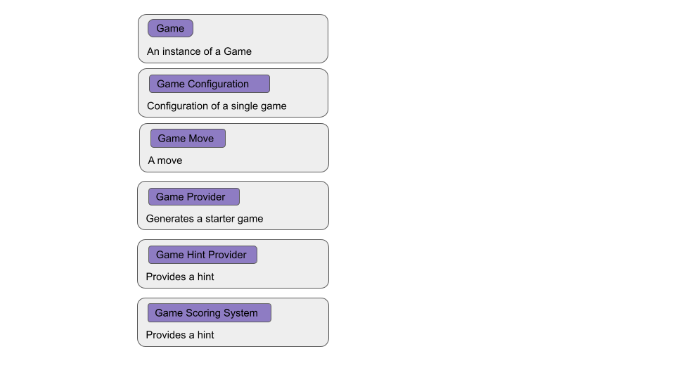

# The Anatomy of the game

The project divides the logic into two parts: the game logic and the presentation logic. The game logic is independent,
however presentation logic is dependent on the game logic.

## Game

The project should be extensible to favour multiple games. Therefore, the game defines common logic that all implemented
games follow. The logic includes:



#### Game

Contains the details of an ongoing game

```kotlin
interface Game<G : Game, M : GameMove> {

    /** Return the resulting [Game] after playing a [GameMove] */
    fun play(move: M): G

    /** Check to verify that the current iteration of the game is valid*/
    fun isValid(): Boolean

    /** Check if the game is already won */
    fun isWon(): Boolean

    /** Check if a win is not possible from the given game */
    fun isDrawn(): Boolean
}
```

The game should also implement methods for playing a move, checking for validity of the game, checking if the game is a
win/lose

> **Klondike**  
> In klondike, a klondike game is implemented as
> ```kotlin
>    /** A solitaire game */
>    data class SolitaireGame(
>        val configuration: SolitaireGameConfiguration,
>
>        val deckPositions: List<Int> = emptyList(),
>
>        val deck: List<Card>,
>
>        val spadeFoundationStack: List<Card>,
>        val cloverFoundationStack: List<Card>,
>        val heartsFoundationStack: List<Card>,
>        val diamondFoundationStack: List<Card>,
>
>        val firstTableStackState: TableStack,
>        val secondTableStackState: TableStack,
>        val thirdTableStackState: TableStack,
>        val fourthTableStackState: TableStack,
>        val fifthTableStackState: TableStack,
>        val sixthTableStackState: TableStack,
>        val seventhTableStackState: TableStack
>    )
>```

#### GameConfiguration

The specific configuration/preferences of a game, for example, in Klondike the game is configured to have either one or
three cards per deal

```kotlin
interface GameConfiguration<G : Game, M : GameMove>
```

> **Klondike**  
> GameConfiguration in Klondike is:
> ```kotlin
> /** The configuration of a [SolitaireGame] */
> data class SolitaireGameConfiguration(
>   /** The number of cards dealt on a single deal */
>   val cardsPerDeal: SolitaireCardsPerDeal
> ): GameConfiguration<SolitaireGame, SolitaireGameMove>
>```

##### Game Move

These are all the possible user/automated moves that occur in the game. It is a mechanism used by players to play a
move, the hint provider to express a possible move, and also make adjustments such as revealing a card in a game

```kotlin
interface GameMove<G : Game, M : GameMove> {

    val time: Instant

    fun isValid(game: G): Boolean

    fun reversed(): M?
}
```

Each move should have a check to verify the correctness of the move in regard to the context of a specific game.

> **Klondike**  
> In Klondike, a game move is defined as:
> ```kotlin
> sealed class SolitaireGameMove : GameMove<SolitaireGame, SolitaireGameMove> {
>    /** Reverses a [SolitaireUserMove.Deal] move */
>    data class Undeal(
>        val offset: SolitaireDealOffset
>    ): SolitaireGameMove()
> 
>   /** Reveals the top-most hidden card on a table stack.*/
>   data class RevealCard(
>        val tableStackEntry: TableStackEntry
>    ): SolitaireGameMove()
> 
>   /** Hides the bottom-most revealed card on a table stack.*/
>   data class HideCard(
>        val tableStackEntry: TableStackEntry
>    ): SolitaireGameMove()
>   
>    /** Returns a card to the deck*/
>    data class ReturnToDeck(
>        val card: Card,
>        val from: ReturnToDeckSource,
>        val index: Int
>    ): SolitaireGameMove()
>
>    /** Valid player moves */
>    sealed class SolitaireUserMove : SolitaireGameMove() {
>       
>       data class Deal(
>           val offset: SolitaireDealOffset
>       ) : SolitaireUserMove() 
> 
>       data class CardMove(
>           val cards: List<Card>,
>           val from: MoveSource,
>           val to: MoveDestination
>       ) : SolitaireUserMove()
>    }
> }
>```

#### GameProvider

Provides a start game to the player

```kotlin
interface GameProvider<G : Game, M : GameMove, C : GameConfiguration> {
    suspend fun createGame(configuration: C): G
}
```

It is mainly implemented using objects, for example, `VeryEasyGameProvider` provides a very easy game to the player

> **Klondike**  
> In Klondike, a game provider is defined as:
> ```kotlin
> sealed class SolitaireGameProvider: GameProvider<SolitaireGame, SolitaireGameMove, SolitaireGameConfiguration>
> ```
>
> There are two providers in the game: `VeryEasySolitaireGameProvider` and `RandomSolitaireGameProvider`

#### GameHintProvider

Provides hints for a particular game

```kotlin
/** Provides a hint provision system for the game. */
interface GameHintProvider<G : Game, M : GameMove> {

    /** Provides the hints based on the [game] provided. */
    fun provideHints(game: G): List<M>
}
```

The provider has a function `provideHints` that takes in a Game and returns a list of GameMoves

> **Klondike**  
> Klondike's implementation of a hint provider is:
> ```kotlin
> object SolitaireHintProvider : GameHintProvider<SolitaireGame, SolitaireGameMove> {
>    override fun provideHints(game: SolitaireGame): List<SolitaireGameMove> { ... }
> }
>```

